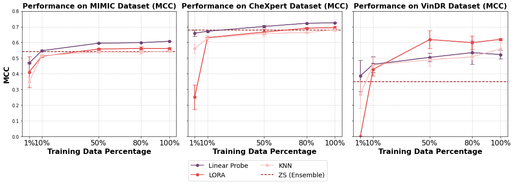
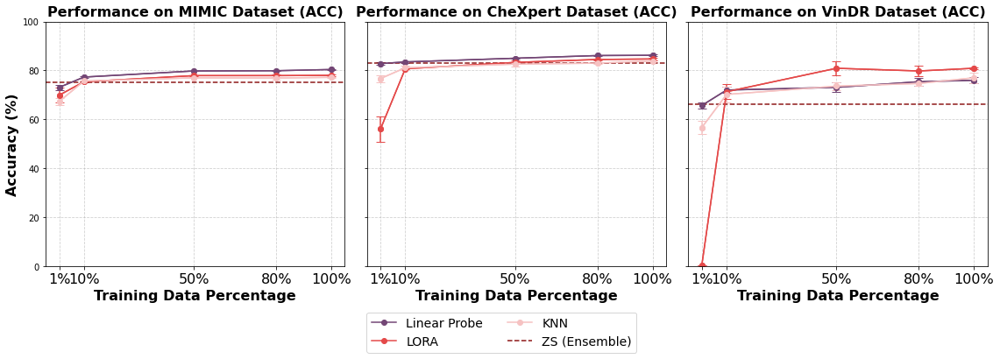
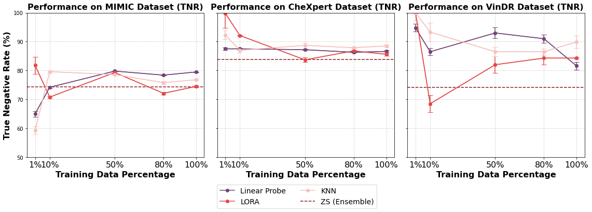
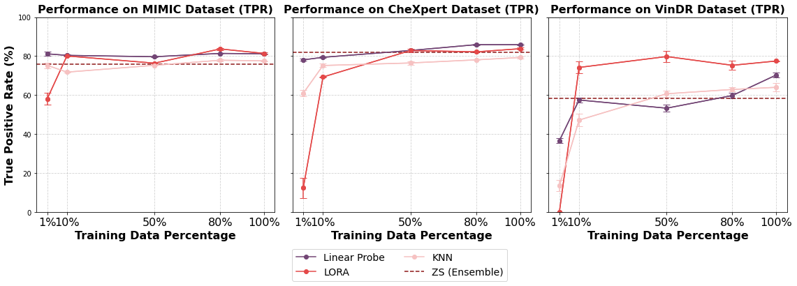

# MedImageInsight - Comparison Zero-shot (Ensemble) with training-based methods

### Training-based methods: 
* Linear Probe
* LoRA Fine-tuning
* k-NN

## Matthew's correlation coefficient

  

## Accuracy

  

## True negative Rate (TNR)

  

## True postive Rate (TPR)

  

